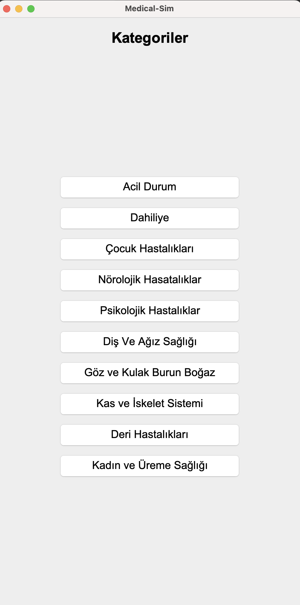
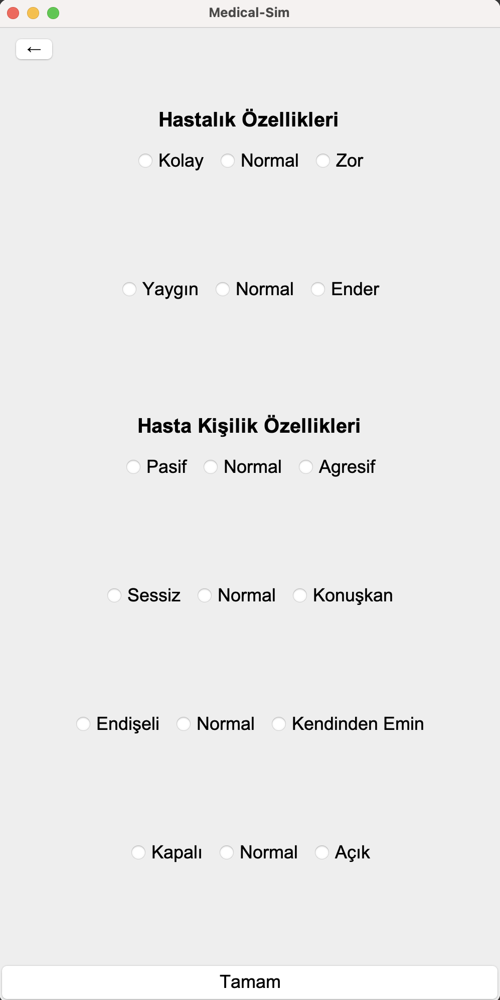
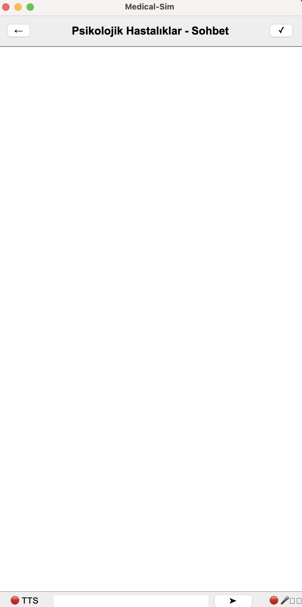

# 🩺 Medical-Sim

**AI-assisted medical case simulation tool for medical school students.**

Medical-Sim is an interactive learning application that allows medical students to practice **diagnostic reasoning** with simulated patients powered by artificial intelligence.

The system dynamically generates realistic patient behavior based on structured disease data and advanced prompt engineering, encouraging students to actively question, analyze symptoms, and form accurate diagnoses.

---

## 🚀 Features

### 🧩 Category Page
- Choose a **disease category** (e.g., Emergency, Pediatric Diseases, Psychological Diseases, etc.).
- Supports multiple medical branches with diverse disease types.

### ⚙️ Settings Page
- Customize **disease difficulty**:
  - **Easy**, **Medium**, or **Hard**
- Select **disease rarity**:
  - **Common**, **Medium**, or **Rare**
- Define **patient personality traits**:
  - *Calm*, *Aggressive*, *Talkative*, *Reserved*

### 💬 Chat Page
- The AI **acts as the patient**.
- Students can:
  - Chat via **text**
  - Listen via **Text-to-Speech (TTS)**
  - Speak using a **microphone (Speech-to-Text)**
- Designed to simulate a real clinical anamnesis process.

### 🧠 Diagnosis Evaluation
- Students submit their diagnosis after the interaction.
- The AI evaluates:
  - Diagnostic accuracy
  - Reasoning quality
- Provides structured feedback to support learning.

---

## 🆕 Newly Added System Features

### 🗂️ Structured Disease Knowledge Base
- Diseases are stored in an external **`Diseases.json`** file.
- Dataset includes:
  - **10 medical categories**
  - **~30 diseases per category**
- Each disease contains:
  - Name
  - Difficulty
  - Rarity
  - Description
  - Core symptoms
- Enables easy expansion without code changes.

---

### 🎯 Disease Selection & Filtering Engine
- Diseases are selected dynamically based on:
  - Selected category
  - Difficulty level
  - Rarity
- A random but **medically valid** disease is chosen using a filtering engine.
- Ensures high replayability and varied simulation scenarios.

---

### 👤 AI-Driven Patient Profile Generation
- Selected disease data is injected into a dedicated **patient profile prompt**.
- The AI:
  - Knows the disease internally
  - **Never directly reveals the disease name or medical facts**
  - Expresses symptoms naturally through patient behavior
- Students must extract information through questioning, mimicking real clinical practice.

---

### 🧠 External Prompt Management System
- All AI prompts are stored as **external `.txt` files** under the `prompts/` directory:
  - `base_prompt.txt`
  - `patient_profile_prompt.txt`
  - `diagnosis_feedback_prompt.txt`
  - `system_break_prompt.txt`
- Prompts are dynamically loaded at runtime.
- Supports template variables using `{{PLACEHOLDER}}` syntax.
- Enables prompt engineering without modifying source code.

---

### 🔁 Dynamic Prompt Injection
- Disease and session data are injected into prompts at runtime:
  - Category
  - Disease name
  - Symptoms
  - Description
  - Language
- Ensures:
  - Context-aware AI responses
  - High consistency across simulations

---

### 📝 Logging System
- The application includes an automatic **logging system**.
- For each session:
  - A new timestamped log file is created under the `logs/` directory.
  - Format: `log_YYYY-MM-DD_HH-mm-ss.txt`
- Logs can include:
  - System messages
  - AI responses
  - Debug and trace data
- Improves traceability, debugging, and future analysis.

---

## 🖼️ Screenshots

  
   
  
   
  

---

## 🛠️ Tech Stack

### Language & Framework
- ☕ **Java 19**
- 🧱 **Swing (Java GUI Framework)**
- ⚙️ **Maven** for dependency and build management

### Libraries & Dependencies
- 📡 **OkHttp (4.12.0)** — OpenAI API communication
- 🧩 **Gson (2.10.1)** — JSON serialization/deserialization
- 🔊 **JLayer (1.0.1)** — MP3 playback for TTS responses

### APIs & Integrations
- 🤖 **OpenAI GPT API** — AI patient simulation
- 🗣️ **OpenAI Text-to-Speech API**
- 🎙️ **OpenAI Whisper API** — Speech-to-text transcription

### Build Configuration
- 🧩 **maven-compiler-plugin (3.11.0)**
  - Source: **Java 19**
  - Target: **Java 19**

---

## ⚠️ Disclaimer
This application is designed **for educational purposes only**.  
It does **not provide real medical advice**, diagnosis, or treatment recommendations.

---

## 🔮 Future Improvements
- Case history saving
- Performance-based scoring system
- Multi-language expansion
- Instructor / admin panel
- Analytics dashboard for student progress

---

## 👨‍🎓 Project Type
This project was developed as a **graduation (capstone) project** focused on combining:
- Artificial Intelligence
- Medical education
- Interactive simulation systems
